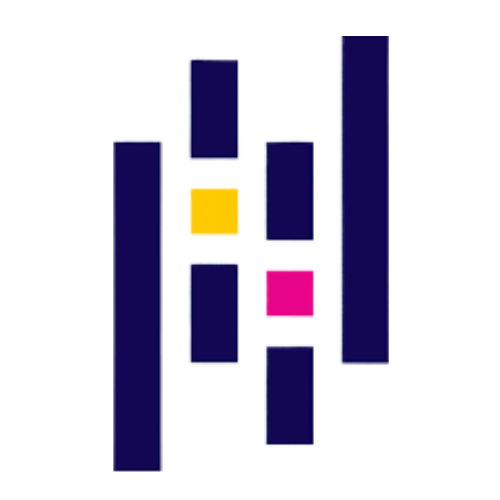

## Hey how's it going? My name is Breno, nice to have you here.

Here are some ideas to get you started:

- ♟ I currently work in the area of ​​digital marketing, graphic design and programing
- 🔗 I am currently studying high school and technical courses
- 🐼 I seek to collaborate in areas of programming language and agricultural sciences
- 🕷 I'm looking for help in understanding more and more the area of ​​computing and its languages
- ⚙ How to reach me: Instagram, Discord or E-mail
- 🎞 Pronouns: he/him
- 📷 Me: 18 years old, I have two technologists and a specialization, I love the area of ​​programming language and human behavior and I'm fascinated by literature and black cats

##

  
  
  
  
  
  
  
  
  
  
  
  
  
  
  
  
  
  

##

  

  

##

  

  
##

  
